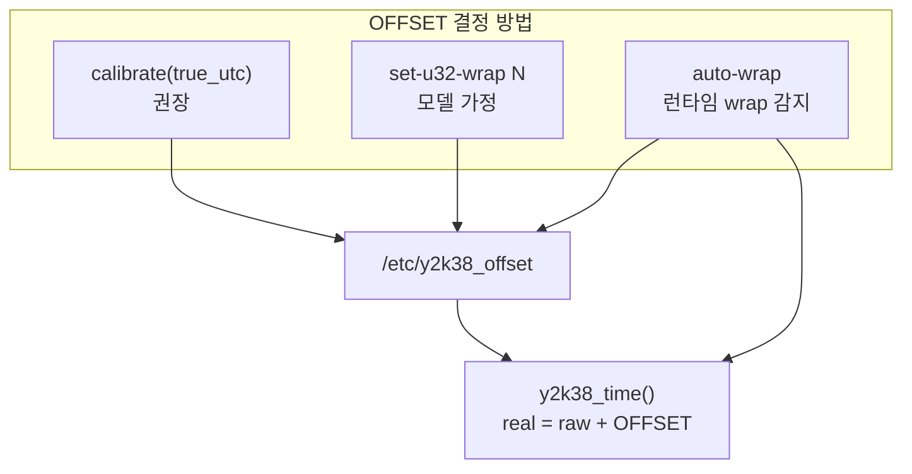

# Calibration 상세 설명

이 프로젝트에서 **calibration(교정)** 은, 32-bit 커널 시계가 이미 wrap되어 **잘못된 `time_t`** 를 줄 때, **신뢰할 수 있는 실제 UTC**와 비교해 **OFFSET**을 계산·저장하는 과정입니다.

```
real_utc = kernel_raw + OFFSET
OFFSET   = true_utc - kernel_raw
```

calibration은 **커널 시계 자체를 바꾸지 않습니다**. userspace에서 `y2k38_time()`이 반환하는 **앱이 보는 UTC**만 맞춥니다.

---

## 1. 왜 calibration이 필요한가?

`liby2k38safe`는 **저장·연산**을 int64(`y2k38_time_t`)로 처리합니다. 로그·delta는 2038 이후에도 안전합니다.

하지만 **“지금 몇 시인가?”** 는 여전히 커널 `gettimeofday()`에 의존합니다. ELDK PPC32에서는 `tv_sec`가 **signed 32-bit `time_t`** 입니다.

| 시점 | 커널이 주는 값 | int64로 넓히면 |
|------|----------------|----------------|
| 2038 직전 | `2147483647` | `2147483647` |
| 2038 직후 1초 | `(int32_t)2147483648` | **`-2147483648`** |

커널은 음수를 주지만, 실제 UTC는 **2147483648** 이상입니다.  
이 차이를 메우는 것이 **OFFSET**, 그 OFFSET을 맞추는 것이 **calibration**입니다.

---

## 2. 핵심 수식

```13:17:lib/y2k38_offset.c
y2k38_time_t y2k38_clock_compute_offset(y2k38_time_t true_utc,
                                        y2k38_time_t kernel_raw)
{
    return true_utc - kernel_raw;
}
```

| 변수 | 의미 | 출처 |
|------|------|------|
| **true_utc** | 신뢰하는 실제 UTC epoch (int64) | GPS, NTP, 운영자 시계 등 |
| **kernel_raw** | OFFSET **미적용** 커널 초 | `y2k38_time_kernel_raw()` |
| **OFFSET** | 보정값 | `true_utc - kernel_raw` |

복구:

```
y2k38_time() = kernel_raw + OFFSET = true_utc  (calibration 직후)
```

### 숫자 예 (2038+100초)

```
true_utc   = 2147483748        (2038-01-19 03:15:48 UTC)
kernel     = -2147483548       (wrap된 signed 32-bit 잔여)
OFFSET     = 2147483748 - (-2147483548) = 4294967296  (= 2^32)

recovered  = -2147483548 + 4294967296 = 2147483748  ✓
```

`set-u32-wrap 1`과 결과가 같을 수 있지만, calibration은 **wrap 1회 가정 없이** 실제 시각만 맞으면 됩니다.

---

## 3. calibration이 다루는 것 / 다루지 않는 것

| calibration이 하는 것 | calibration이 하지 않는 것 |
|----------------------|---------------------------|
| OFFSET 계산·파일 저장 | `settimeofday()` 등 커널 시계 변경 |
| 현재 프로세스에 OFFSET 즉시 반영 | 다른 이미 실행 중인 프로세스 자동 갱신 |
| `y2k38_time()` 복구 UTC 맞춤 | libc `time_t` 타입 변경 |
| 데몬 기동 시 로드할 OFFSET 제공 | 32-bit 절대 타이머(`timer_settime` 등) 수정 |

---

## 4. 실행 방법

### 4.1 CLI (보드 운영, 권장)

```bash
y2k38_offsetctl calibrate <true_utc_epoch> [--file PATH] [--mock-kernel SEC]
```

**내부 동작 (`tools/y2k38_offsetctl.c`):**

```85:96:tools/y2k38_offsetctl.c
static int cmd_calibrate(const char *path, y2k38_time_t true_utc)
{
    y2k38_time_t raw;
    y2k38_time_t offset;

    raw = y2k38_time_kernel_raw(NULL);
    offset = y2k38_clock_compute_offset(true_utc, raw);
    // ... 출력 ...
    return cmd_set(path, offset);  // 파일 저장 + 메모리 반영
}
```

1. 지금 `kernel_raw` 읽기  
2. `OFFSET = true_utc - raw` 계산  
3. `/etc/y2k38_offset`에 저장  
4. `y2k38_clock_set_kernel_offset(offset)` — **이 프로세스**에 즉시 적용  

**출력 예:**

```
true_utc   = 2147483748
kernel_raw = -2147483548
offset     = 4294967296
wrote OFFSET 4294967296 to /etc/y2k38_offset
```

**검증:**

```bash
y2k38_offsetctl show --file /etc/y2k38_offset
# utc_now가 true_utc와 일치해야 함
```

### 4.2 API (앱·스크립트에서 직접)

```c
y2k38_time_t true_utc = gps_read_epoch();   /* 신뢰 UTC */
y2k38_time_t raw      = y2k38_time_kernel_raw(NULL);
y2k38_time_t off      = y2k38_clock_compute_offset(true_utc, raw);

y2k38_clock_save_offset_file("/etc/y2k38_offset", off);
y2k38_clock_set_kernel_offset(off);
```

`examples/fixed/kernel_offset_demo.c`가 같은 흐름을 코드로 보여줍니다.

### 4.3 테스트용 mock

```bash
y2k38_offsetctl calibrate 2147483748 \
  --file /tmp/y2k38_off.conf \
  --mock-kernel -2147483548
```

`--mock-kernel`은 실제 `gettimeofday` 대신 wrap된 커널 값을 에뮬합니다. `make check-offset`에서 사용합니다.

---

## 5. true_utc (신뢰 UTC) 출처

calibration 품질은 **true_utc의 정확도**에 달려 있습니다.

| 출처 | 적합한 경우 | 주의 |
|------|-------------|------|
| **GPS UART** | 야외 장비, 고정밀 | epoch int64로 전달 |
| **NTP 동기화 게이트웨이** | 네트워크 연결 보드 | NTP 자체가 32-bit면 호스트에서 epoch 받기 |
| **스테이징 호스트 `date +%s`** | 초기 설치·랩 | 설치 순간에만 유효 |
| **운영자 수동 입력** | 긴급 복구 | 사람 오차 |
| **다른 y2k38 보정된 시스템** | 클러스터 동기화 | 같은 OFFSET 정책 전제 |

**중요:** true_utc는 반드시 **int64 epoch 초**여야 합니다. 2038 이후 시각도 그대로 넘깁니다.

```bash
# 호스트(64-bit)에서 현재 epoch
date +%s

# 보드에서 calibration
y2k38_offsetctl calibrate <위에서_받은_값> --file /etc/y2k38_offset
```

---

## 6. OFFSET 파일

calibration 결과는 기본적으로 `/etc/y2k38_offset`에 저장됩니다.

```
# y2k38 kernel clock offset (seconds)
# real_utc = sign_extend(kernel_time_t) + OFFSET
OFFSET 4294967296
```

| 항목 | 값 |
|------|-----|
| 기본 경로 | `/etc/y2k38_offset` |
| 환경 변수 | `Y2K38_KERNEL_OFFSET_FILE` |
| 권한 | root 소유 권장 (단일 calibrator) |

데몬·앱은 기동 시 `y2k38_clock_apply_offset_default()`로 이 파일을 읽습니다.

---

## 7. calibration vs 다른 OFFSET 설정 방법

| 방법 | 명령/API | 가정 | 언제 쓰나 |
|------|----------|------|-----------|
| **Calibration** | `calibrate <true_utc>` | 신뢰 UTC 있음 | **보드 운영 권장** |
| **직접 설정** | `set <offset>` | OFFSET 값을 이미 앎 | 파일 복원·수동 조정 |
| **u32 wrap** | `set-u32-wrap 1` | 정확히 1회 unsigned wrap | GPS 없을 때 근사 |
| **Auto-wrap** | `--auto-wrap` (데몬 A) | wrap **순간** 자동 감지 | 장기 실행 데몬 |

### 관계도



- **calibration**: 절대 시각 기준, **가장 정확**
- **auto-wrap**: wrap **이벤트** 포착, 드리프트는 못 잡음
- **병행**: auto-wrap으로 wrap 통과 + 주기적 calibration으로 드리프트·RTC 오차 보정

---

## 8. 전체 운영 흐름

### 시나리오 A — pre-2038 (커널 정상)

```
OFFSET = 0 (파일 없어도 됨)
calibration 불필요 (미래 스케줄만 int64로 저장)
```

### 시나리오 B — 2038 wrap 직후 (GPS/NTP 있음)

```bash
# 1) 신뢰 UTC 확보
TRUE=$(gps_read_epoch)   # 예: 2147483748

# 2) calibration
y2k38_offsetctl calibrate $TRUE --file /etc/y2k38_offset

# 3) 확인
y2k38_offsetctl show

# 4) 데몬 기동 (같은 offset 파일)
daemon_a /var/log/events.log --offset-file /etc/y2k38_offset
daemon_b /var/log/events.log /var/run/deltas.out 10 \
  --offset-file /etc/y2k38_offset
```

### 시나리오 C — 장기 실행 + wrap 자동 + 주기 교정

```bash
# 데몬: wrap 자동 처리
daemon_a /var/log/events.log --auto-wrap --offset-file /etc/y2k38_offset

# cron/게이트웨이: 하루 1회 NTP calibration
0 3 * * * y2k38_offsetctl calibrate $(ntp_epoch) --file /etc/y2k38_offset
```

---

## 9. calibration 후 프로세스 동기화

calibration은 **실행한 프로세스**에만 OFFSET을 즉시 반영합니다.

| 프로세스 | calibration 후 동작 |
|----------|---------------------|
| `y2k38_offsetctl` 자체 | 즉시 반영 |
| **아직 안 뜬** 데몬 | 기동 시 파일 로드 → OK |
| **이미 떠 있는** 데몬 | **파일만 바뀜, 메모리는 구 OFFSET** |

이미 실행 중인 데몬을 맞추려면:

1. 데몬 재기동 (가장 단순), 또는  
2. 앱에 `y2k38_clock_load_offset_file()` 호출 경로 추가 (SIGHUP 등)

운영 원칙: **OFFSET 변경은 한 곳에서만** (`y2k38_offsetctl` 또는 NTP 에이전트).

---

## 10. calibration이 맞는지 확인하는 방법

### check 1 — offsetctl show

```bash
y2k38_offsetctl show
```

`utc_now`가 신뢰 시계와 일치하는지 비교.

### check 2 — make check-offset (개발 호스트)

```makefile
./tools/y2k38_offsetctl calibrate 2147483748 --file /tmp/y2k38_off.conf \
    --mock-kernel -2147483548
./tools/y2k38_offsetctl show --file /tmp/y2k38_off.conf \
    --mock-kernel -2147483548
```

### check 3 — Daemon B delta

```bash
daemon_b /var/log/events.log /var/run/deltas.out --once
```

`FUT2038`, `FAR2100` 이벤트의 delta가 **양수·합리적**이면 calibration + 데몬 OFFSET이 맞습니다.

---

## 11. 언제 다시 calibration해야 하나?

| 이벤트 | 이유 |
|--------|------|
| **2038 wrap 직후** | kernel_raw가 음수로 바뀜 |
| **RTC 배터리 교체** | 하드웨어 시계 점프 |
| **수동 `date` 설정** | kernel과 true_utc 불일치 |
| **auto-wrap 후 드리프트** | wrap은 잡았지만 RTC가 느림/빠름 |
| **보드 재설치** | OFFSET 파일 초기화 |

pre-2038이고 커널이 정확하면 **불필요**합니다.

---

## 12. 제한·주의사항

1. **단일 진실 원천** — 여러 프로세스가 서로 다른 OFFSET을 쓰면 시계가 갈라집니다. 파일 하나, calibrator 하나.
2. **커널 미변경** — `strace`로 `settimeofday`가 없음을 확인할 수 있습니다. libc `time()`은 여전히 wrap된 값.
3. **다른 앱과의 공존** — y2k38 미사용 앱은 여전히 32-bit `time_t` 문제를 겪습니다.
4. **true_utc 오류** — 잘못된 GPS/NTP면 전체 시스템 시계가 틀어집니다. calibration 전에 신뢰 소스 검증이 필수.
5. **권한** — `/etc/y2k38_offset` 쓰기에 root 필요.

---

## 13. 코드 경로 요약

```
[신뢰 UTC] true_utc
      │
      ▼
y2k38_offsetctl calibrate
      │
      ├─ y2k38_time_kernel_raw()  ← gettimeofday (wrap된 raw)
      ├─ y2k38_clock_compute_offset(true, raw)
      ├─ y2k38_clock_save_offset_file("/etc/y2k38_offset", offset)
      └─ y2k38_clock_set_kernel_offset(offset)
      │
      ▼
/etc/y2k38_offset  ──기동 시 로드──►  daemon_a / daemon_b / 앱
      │
      ▼
y2k38_time() = kernel_raw + OFFSET  →  복구된 UTC
```

---

## 한 줄 요약

**Calibration** = 신뢰하는 실제 UTC(`true_utc`)와 지금 커널이 주는 raw 초를 비교해 `OFFSET = true_utc - kernel_raw`를 계산하고 `/etc/y2k38_offset`에 저장하는 과정입니다. 커널 시계를 고치지 않고, `y2k38_time()`이 반환하는 **앱 수준의 UTC**를 2038 wrap 이후에도 맞추는 **가장 정확하고 권장되는** OFFSET 설정 방법입니다.