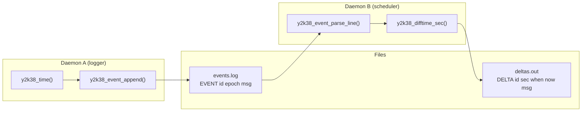

`daemons/`에는 **Y2K38-safe 시계를 쓰는 참조 데몬 2개**가 있습니다. 실제 보드에서 “이벤트 기록 → 미래 시각까지 남은 시간 계산” 파이프라인을 보여주는 샘플입니다.

```
daemons/
├── daemon_a/
│   └── daemon_a.c    → 이벤트 로거 (EVENT 기록)
└── daemon_b/
    └── daemon_b.c    → 스케줄러 (DELTA 재계산)
```

빌드·설치:

```bash
make daemons
# → daemons/daemon_a/daemon_a
# → daemons/daemon_b/daemon_b

make install / make stage
# → /usr/bin/daemon_a, /usr/bin/daemon_b
```

둘 다 `liby2k38safe.a`에 **정적 링크**됩니다.

---

## 전체 아키텍처



| 데몬 | 역할 | 핵심 API |
|------|------|----------|
| **Daemon A** | 64-bit epoch로 이벤트 기록 | `y2k38_time()`, `y2k38_event_append()` |
| **Daemon B** | 이벤트까지 남은 초(delta) 계산 | `y2k38_event_parse_line()`, `y2k38_difftime_sec()` |

두 데몬이 **같은 OFFSET 파일**을 쓰면, 커널 wrap 이후에도 `now`와 `delta`가 일치합니다.

---

## 공통: OFFSET·mock 옵션

두 데몬 모두 기동 시 `apply_startup_offset()`으로 OFFSET을 로드합니다.

| 옵션 | 설명 |
|------|------|
| `--offset-file PATH` | OFFSET 파일 경로 지정 |
| `--no-offset-file` | OFFSET 로드 안 함 (OFFSET=0) |
| (기본) | `$Y2K38_KERNEL_OFFSET_FILE` 또는 `/etc/y2k38_offset` |
| `--mock-now EPOCH` | 절대 UTC mock (kernel/offset 무시) |
| `--mock-kernel SEC` | signed 32-bit 커널 초 에뮬 |
| `--once` | 한 번 실행 후 종료 |
| SIGINT/SIGTERM | 정상 종료 |

**차이점:** `--auto-wrap`은 **Daemon A만** 지원합니다.

---

## 1. Daemon A — 이벤트 로거

**파일:** `daemons/daemon_a/daemon_a.c`

### 사용법

```bash
daemon_a <logfile> [options]
```

### 옵션 (Daemon B 대비 추가)

| 옵션 | 설명 |
|------|------|
| `--auto-wrap` | 32-bit kernel wrap 감지 시 OFFSET += 2³², 파일에 저장 |
| (위 공통 옵션) | `--once`, `--mock-now`, `--mock-kernel`, `--offset-file`, `--no-offset-file` |

### 기동 흐름

1. OFFSET 파일 로드 (`y2k38_clock_apply_offset_default`)
2. `--auto-wrap`이면 `y2k38_clock_set_auto_wrap(1, persist_path)` 활성화
3. mock 옵션 적용
4. 로그 파일을 **append** 모드로 열기
5. `seed_future_samples()` — 샘플 이벤트 3개 기록
6. `--once`면 여기서 종료, 아니면 메인 루프 진입

### 시드 이벤트 (기동 시 자동 기록)

| ID | when (epoch) | 의미 |
|----|--------------|------|
| `FUT2038` | `Y2K38_OVERFLOW_EPOCH_SEC` | 2038 overflow 직후 1초 |
| `FAR2100` | `4102444800` | 2100-01-01 |
| `NEAR` | `now + 120` | 2분 후 상대 스케줄 |

### 메인 루프 (장기 실행)

- **5초마다** heartbeat `HB` 이벤트 기록 (`beat.when = y2k38_time(NULL)`)
- `select()`로 stdin 대기 — 명령이 오면 즉시 처리

### stdin 프로토콜

```
EVENT <id> <epoch64|NOW> <message...>
SCHED <id> <epoch64> <message...>
```

| 명령 | 설명 |
|------|------|
| `EVENT` | 일반 이벤트 (`NOW` = 현재 `y2k38_time()`) |
| `SCHED` | 미래 시각 명시 스케줄 (`epoch64` 필수) |

**로그 한 줄 형식:**

```
EVENT FUT2038 2147483648 first-second-after-time_t-overflow
EVENT HB 1735689600 heartbeat
```

모든 시각은 **int64 epoch 문자열** — `%ld`나 32-bit `time_t`를 쓰지 않습니다.

### auto-wrap (Daemon A 전용)

```185:191:daemons/daemon_a/daemon_a.c
    if (auto_wrap) {
        const char *persist = offset_file;
        if (!persist || no_offset)
            persist = Y2K38_OFFSET_PATH_DEFAULT;
        y2k38_clock_set_auto_wrap(1, persist);
```

pre-2038에 시작한 데몬이 2038 순간 **재시작 없이** UTC를 유지합니다. `y2k38_time()` 호출마다 wrap을 감지하고 OFFSET을 올립니다.

### 실행 예

```bash
# 기본: 장기 실행, OFFSET 자동 로드
daemon_a /var/log/events.log

# wrap 자동 처리 + OFFSET 영속
daemon_a /var/log/events.log --auto-wrap --offset-file /etc/y2k38_offset

# 테스트: 샘플만 기록 후 종료
daemon_a /tmp/events.log --once --mock-kernel -2147483548 \
  --offset-file /tmp/offset

# stdin으로 이벤트 추가 (별도 터미널)
echo "EVENT ALARM 4102444800 century-check" | daemon_a /var/log/events.log
```

---

## 2. Daemon B — delta 스케줄러

**파일:** `daemons/daemon_b/daemon_b.c`

### 사용법

```bash
daemon_b <event_log> <delta_out> [period_sec] [options]
```

| 인자 | 기본값 | 설명 |
|------|--------|------|
| `event_log` | (필수) | Daemon A가 쓴 로그 |
| `delta_out` | (필수) | DELTA 출력 파일 |
| `period_sec` | 5 | 재계산 주기(초) |

### 동작

`recomputedeltas()`가 매 주기마다:

1. 이벤트 로그 전체 읽기
2. 각 줄 `y2k38_event_parse_line()` 파싱
3. `HB`(heartbeat)는 **스킵** — “지금” 스냅샷이라 스케줄 대상 아님
4. `delta = y2k38_difftime_sec(ev.when, now)` — **int64 뺄셈**
5. delta 파일에 기록

### 출력 형식

```
# recomputed at 1735689600
DELTA FUT2038 12345 2147483648 1735676255 first-second-after-time_t-overflow
DELTA FAR2100 2366755200 4102444800 1735689600 century-maintenance-window
DELTA NEAR 95 1735689695 1735689600 relative-plus-120s
```

| 필드 | 의미 |
|------|------|
| `DELTA` | 고정 토큰 |
| `<id>` | 이벤트 ID |
| `<seconds>` | `when - now` (남은 초, 음수면 이미 지남) |
| `<when_epoch>` | 이벤트 시각 |
| `<now_epoch>` | 계산 시점 now |
| `<msg>` | 메시지 |

출력 파일은 매 주기 **`fseek(0)`으로 덮어쓰기** — 최신 delta 스냅샷만 유지합니다.

### Daemon A와의 차이

| 항목 | Daemon A | Daemon B |
|------|----------|----------|
| `--auto-wrap` | **있음** | **없음** |
| stdin 처리 | `select()` + 명령 | 없음 |
| 출력 | append 로그 | 덮어쓰기 delta |
| 주기 동작 | 5초 heartbeat + stdin | `period_sec`마다 전체 재계산 |

Daemon B는 **읽기 전용**이라 auto-wrap이 없습니다. A와 같은 OFFSET 파일을 쓰거나, A가 wrap 시 OFFSET을 갱신하면 B도 다음 `y2k38_time()`에서 맞는 UTC를 봅니다.

### 실행 예

```bash
# Daemon A와 함께
daemon_a /var/log/events.log --offset-file /etc/y2k38_offset &
daemon_b /var/log/events.log /var/run/deltas.out 10 \
  --offset-file /etc/y2k38_offset

# 한 번만 계산
daemon_b /var/log/events.log /tmp/deltas.out --once \
  --mock-now 2147483600
```

---

## A + B 파이프라인 예시

```bash
# 1) OFFSET 설정 (wrap 후 보드)
y2k38_offsetctl calibrate 2147483748 --file /etc/y2k38_offset

# 2) Daemon A: 이벤트 기록 + auto-wrap
daemon_a /var/log/events.log \
  --auto-wrap \
  --offset-file /etc/y2k38_offset &

# 3) Daemon B: 10초마다 delta 재계산
daemon_b /var/log/events.log /var/run/deltas.out 10 \
  --offset-file /etc/y2k38_offset &
```

**2038 경계에서 기대 동작:**

- A: `FUT2038` 이벤트는 epoch `2147483648`로 **항상 동일**하게 저장
- B: `y2k38_difftime_sec(2147483648, now)` → now가 pre/post-2038 어디든 **올바른 초**
- broken 파이프라인(`examples/broken/broken_daemon_pipeline`)과 달리 delta가 음수/오버플로로 깨지지 않음

---

## broken 예제와의 대비

| | broken pipeline | daemon_a + daemon_b |
|--|-----------------|---------------------|
| 시각 타입 | `int32_t` / `time_t` | `y2k38_time_t` (int64) |
| 로그 epoch | 32-bit로 잘림 | 64-bit 문자열 |
| delta | `(long)future - (long)now` | `y2k38_difftime_sec()` |
| wrap 복구 | 없음 | OFFSET + `--auto-wrap` (A) |

---

## 내부 구조 요약

### Daemon A

```
main()
├── apply_startup_offset()
├── y2k38_clock_set_auto_wrap()     [optional]
├── seed_future_samples()           FUT2038, FAR2100, NEAR
└── while (g_run)
    ├── heartbeat (HB) every 5s
    └── select(stdin) → handle_command(EVENT|SCHED)
```

### Daemon B

```
main()
├── apply_startup_offset()
└── do/while (g_run)
    ├── fseek(out, 0)               overwrite deltas
    ├── recomputedeltas()
    │   ├── parse each EVENT line
    │   ├── skip HB
    │   └── DELTA = difftime(when, now)
    └── sleep(period)
```

---

## 운영 시 주의사항

1. **같은 OFFSET** — A와 B가 다른 OFFSET을 쓰면 delta가 틀어집니다. `--offset-file`을 맞추세요.
2. **Daemon B에 auto-wrap 없음** — 장기 실행 시 A에 `--auto-wrap`을 쓰거나, `y2k38_offsetctl calibrate`로 주기 교정하세요.
3. **로그는 append** — A는 계속 쌓입니다. B는 매번 전체를 읽으므로 로그가 커지면 성능에 영향이 있습니다 (참조 구현 수준).
4. **HB 필터** — B는 heartbeat를 스케줄에서 제외합니다. 실제 스케줄 이벤트만 delta 대상입니다.
5. **정적 링크** — 보드에 `liby2k38safe.so` 없이 바이너리만 배포해도 동작합니다.

---

## 한 줄 요약

| 파일 | 역할 |
|------|------|
| **daemon_a.c** | 64-bit epoch로 `EVENT` 로그 기록, heartbeat, stdin 명령, optional auto-wrap |
| **daemon_b.c** | A의 로그를 읽어 `DELTA`(남은 초)를 주기적으로 재계산·출력 |

`daemons/`는 **liby2k38safe를 실제 장기 실행 프로세스에 붙이는 참조 구현**이며, `examples/fixed/`의 단일 프로세스 데모를 **운영형 2-데몬 파이프라인**으로 확장한 형태입니다.