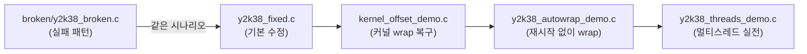

`examples/fixed/`에는 **Y2K38 문제를 `liby2k38safe`로 올바르게 처리하는** 예제 4개가 있습니다. `examples/broken/`이 32-bit `time_t` 실패를 보여준다면, 여기는 같은 시나리오를 **64-bit `y2k38_time_t` + OFFSET + auto-wrap**으로 해결하는 방법을 단계별로 보여줍니다.

```
examples/fixed/
├── y2k38_fixed.c           # 기본 3시나리오 (broken 대응)
├── kernel_offset_demo.c    # OFFSET 파일로 wrap 복구
├── y2k38_autowrap_demo.c   # 장기 실행 + auto-wrap
└── y2k38_threads_demo.c    # 3스레드 동시 처리
```

빌드:

```bash
make examples
# 또는 개별:
make examples/fixed/y2k38_fixed
make examples/fixed/kernel_offset_demo
make examples/fixed/y2k38_autowrap_demo
make examples/fixed/y2k38_threads_demo
```

모두 `liby2k38safe.a`에 정적 링크됩니다.

---

## 전체 관계



| 예제 | 다루는 주제 | 대응 broken 시나리오 |
|------|-------------|----------------------|
| `y2k38_fixed` | int64 저장, delta, 이벤트 로그 | 시나리오 1~3 |
| `kernel_offset_demo` | OFFSET 계산·파일 저장·로드 | (커널 wrap — broken에는 없음) |
| `y2k38_autowrap_demo` | wrap 자동 감지·OFFSET += 2³² | (장기 실행) |
| `y2k38_threads_demo` | pthread + sleep + 스케줄 | (실전 통합) |

---

## 1. `y2k38_fixed.c` — 기본 수정 데모

**목적:** `broken/y2k38_broken.c`와 **동일한 3가지 시나리오**를 라이브러리 API로 통과시키는 것.

### 시나리오 1: 2038 이후 시각 저장

```12:25:examples/fixed/y2k38_fixed.c
static void scenario_store_future(void)
{
    y2k38_time_t real_future = 4102444800LL; /* 2100-01-01 UTC */
    // ...
    y2k38_format_epoch(real_future, buf, sizeof(buf));
    y2k38_format_iso8601_utc(real_future, iso, sizeof(iso));
```

- `y2k38_time_t`(int64)에 2100-01-01 epoch 저장
- `y2k38_format_iso8601_utc()`로 사람이 읽을 수 있는 UTC 출력
- broken에서는 `int32_t`로 잘리거나 음수가 됨 → 여기서는 **값 유지**

### 시나리오 2: 2038 경계 delta 계산

```27:46:examples/fixed/y2k38_fixed.c
    now = Y2K38_TIME_T32_MAX - 100;
    future = Y2K38_TIME_T32_MAX + 500;
    delta = y2k38_difftime_sec(future, now);
    // expected delta = 600
```

- `now`와 `future`가 32-bit `time_t` 최대값을 **넘나듦**
- `y2k38_difftime_sec()` → int64 뺄셈 → **600초** (broken에서는 음수/오버플로)

### 시나리오 3: 데몬 A/B 스타일 이벤트 로그

```48:107:examples/fixed/y2k38_fixed.c
    ev.when = intended;  /* Y2K38_TIME_T32_MAX + 10 */
    y2k38_event_append(fp, &ev);
    // ...
    y2k38_event_parse_line(line, &parsed);
    y2k38_clock_set_mock(1, Y2K38_TIME_T32_MAX - 50);
    now = y2k38_time(NULL);
    delta = y2k38_difftime_sec(parsed.when, now);
```

흐름:

1. **Daemon A 역할** — `EVENT E1 <epoch64> transformer-overheat` 형식으로 `fixed_events.log` 기록
2. **Daemon B 역할** — 로그 파싱 후 `now`와의 delta 계산
3. mock clock으로 `now = INT32_MAX - 50`, 이벤트는 `INT32_MAX + 10` → delta **60초**

**핵심:** 로그에 **int64 epoch**를 문자열로 저장하면 2038 이후에도 파싱·delta가 안전합니다.

**실행:**

```bash
./examples/fixed/y2k38_fixed
```

---

## 2. `kernel_offset_demo.c` — 커널 wrap OFFSET 복구

**목적:** 2038 이후 커널이 **음수 `time_t`**를 반환할 때, OFFSET으로 실제 UTC를 복구하는 과정을 보여줍니다. `make check-offset`에서도 사용됩니다.

### 시나리오 설정

```
true_utc = 2147483748   (2038-01-19 03:14:08 UTC + 100초)
kernel   = (int32_t)true_utc  →  -2147483548  (wrap된 음수)
```

### 처리 단계

| 단계 | API | 설명 |
|------|-----|------|
| 1 | `y2k38_clock_set_mock_kernel(1, wrapped)` | wrap된 커널 시계 에뮬 |
| 2 | `y2k38_time_kernel_raw()` | offset 없는 raw 값 확인 |
| 3 | `y2k38_clock_compute_offset(true_utc, raw)` | `OFFSET = true - raw` |
| 4 | `y2k38_clock_save_offset_file(path, offset)` | 파일 영속화 |
| 5 | offset 0으로 리셋 후 `load_offset_file()` | **데몬 부팅 시** 재현 |
| 6 | `y2k38_time()` | 복구된 UTC 확인 |

성공 시:

```
recovered UTC = 2147483748 (2038-01-19T03:15:48Z)
OK: wrap recovered via OFFSET file
```

추가로 **2100-01-01까지 delta**가 양수인지 검증 — wrap 복구 후에도 장기 스케줄링이 가능함을 보여줍니다.

**`tools/y2k38_offsetctl calibrate`와의 관계:** 이 예제는 라이브러리 API를 직접 호출하고, 운영에서는 동일 로직을 `y2k38_offsetctl calibrate <true_utc>`로 실행합니다.

**실행:**

```bash
./examples/fixed/kernel_offset_demo
# → demo_y2k38_offset.conf 생성
```

---

## 3. `y2k38_autowrap_demo.c` — 재시작 없이 wrap 통과

**목적:** pre-2038에 시작한 **장기 실행 데몬**이 2038 순간에 재시작 없이 UTC를 유지하는 패턴.

### 흐름

```20:56:examples/fixed/y2k38_autowrap_demo.c
    y2k38_clock_apply_offset_default(NULL);
    y2k38_clock_on_wrap_callback(on_wrap, NULL);
    y2k38_clock_set_auto_wrap(1, "/tmp/y2k38_autowrap_offset");

    /* before: kernel near INT32_MAX */
    y2k38_clock_set_mock_kernel(1, (int32_t)(Y2K38_TIME_T32_MAX - 5));
    t0 = y2k38_time(NULL);

    /* after: kernel wraps to negative */
    y2k38_clock_set_mock_kernel(1, (int32_t)Y2K38_OVERFLOW_EPOCH_SEC);
    t1 = y2k38_time(NULL);  /* auto-wrap fires here */
```

| 시점 | kernel mock | OFFSET | UTC |
|------|-------------|--------|-----|
| before | INT32_MAX - 5 | 0 | pre-2038 |
| after wrap | INT32_MIN (overflow+1) | **+2³²** (자동) | 2038+1초 |

`on_wrap` 콜백이 wrap 감지를 출력:

```
WRAP detected: count=1 new_offset=4294967296
OK: continuous daemon would see monotonic UTC across Y2K38
```

**Daemon A의 `--auto-wrap` 옵션**과 같은 메커니즘입니다. OFFSET은 `/tmp/y2k38_autowrap_offset`에 저장되어 다른 프로세스와 공유할 수 있습니다.

**실행:**

```bash
./examples/fixed/y2k38_autowrap_demo
```

---

## 4. `y2k38_threads_demo.c` — 3스레드 실전 패턴

**목적:** 실제 보드에서 흔한 **멀티스레드 데몬**이 동시에 시계를 읽고, 2038 이후 스케줄을 계산하고, 경계를 넘는 sleep을 하는 방법.

### 3개 스레드

| 스레드 | 역할 | 사용 API |
|--------|------|----------|
| **Thread 1 (logger)** | 주기적 시계 샘플링 | `y2k38_time()`, `y2k38_gettimeofday()`, ISO 출력 |
| **Thread 2 (scheduler)** | post-2038 이벤트까지 delta | `y2k38_difftime_sec()`, `y2k38_is_past_time_t32_max()` |
| **Thread 3 (sleeper)** | 절대 시각까지 대기 | `y2k38_sleep_until()` |

### 기본 동작 (mock 모드)

```
mock now  = INT32_MAX - 10   (pre-2038)
wake      = INT32_MAX + 30   (post-2038)
```

- **logger**가 1초마다 mock clock을 +1초 진행 (`mock_tick_if_needed`)
- **sleeper**는 `y2k38_sleep_until(wake)`로 **2038 경계를 넘어** 깨어남
- `y2k38_sleep_set_max_chunk(5)` — 긴 대기를 5초 단위 `nanosleep`으로 쪼갬 (wrap 중에도 `y2k38_time()` 재평가)

### CLI 옵션

```bash
y2k38_threads_demo [--mock-now EPOCH] [--wake-abs EPOCH] [--ticks N]
```

| 옵션 | 기본값 | 설명 |
|------|--------|------|
| `--mock-now` | INT32_MAX - 10 | mock 시작 시각; logger가 매 tick +1초 |
| `--wake-abs` | INT32_MAX + 30 | sleeper 절대 깨움 시각 |
| `--ticks` | 35 | logger/scheduler 반복 횟수 |

mock 없이 실행하면 **실제 시계** 사용, wake는 `now + 5초`로 자동 조정.

### 주의할 점 (예제가 보여주는 "하지 말 것")

```131:134:examples/fixed/y2k38_threads_demo.c
 * NEVER uses timer_settime absolute or time_t-based pthread_cond_timedwait.
```

32-bit `time_t` 기반 **절대 타이머**는 2038 이후 깨집니다. 대신 `y2k38_sleep_until()`처럼 **상대 sleep + y2k38_time() 재평가** 패턴을 씁니다.

**실행 예:**

```bash
./examples/fixed/y2k38_threads_demo
./examples/fixed/y2k38_threads_demo --mock-now 2147483640 --wake-abs 2147483680 --ticks 50
```

---

## 학습 순서 권장

```
1. y2k38_fixed          → broken과 대비, 기본 API 익히기
2. kernel_offset_demo   → wrap 후 OFFSET 수동/파일 복구
3. y2k38_autowrap_demo  → 데몬이 wrap을 자동 처리
4. y2k38_threads_demo   → pthread + sleep 실전 통합
```

---

## Makefile·검증 연동

| 타겟 | 용도 |
|------|------|
| `make examples` | 4개 fixed + broken 전부 빌드 |
| `make check` | `y2k38_fixed` + broken 실행 비교 |
| `make check-offset` | `kernel_offset_demo` + `y2k38_offsetctl` 검증 |
| `make stage` / `install` | `y2k38_fixed`, `kernel_offset_demo`를 `/usr/bin`에 복사 |

---

## 한 줄 요약

| 파일 | 한 줄 설명 |
|------|-----------|
| **y2k38_fixed.c** | int64 저장·delta·이벤트 로그 — broken의 올바른 버전 |
| **kernel_offset_demo.c** | wrap된 커널 시계를 OFFSET 파일로 복구 |
| **y2k38_autowrap_demo.c** | pre-2038 시작 데몬이 wrap 시 OFFSET 자동 증가 |
| **y2k38_threads_demo.c** | logger/scheduler/sleeper 3스레드로 동시 시계·sleep 처리 |